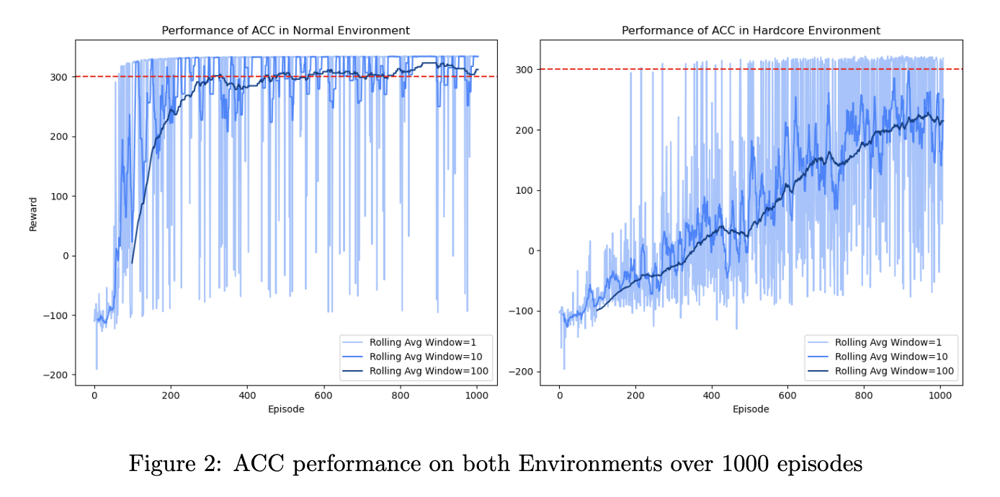

## Project Overview

This project applies the **Adaptively Calibrated Critics (ACC)** algorithm to the **BipedalWalker-v3 environment**, tackling both the easy and hardcore modes. The primary objective was to mitigate overestimation bias in Temporal Difference (TD) targets using ACC, a method that dynamically adjusts quantile truncation to enhance policy learning.

### Easy Mode
<video width="640" height="360" controls>
  <source src="nfqn37-agent-hardcore-mode=900_score=334.mp4" type="video/mp4">
  Your browser does not support the video tag.
</video>

### Hardcore Mode
<video width="640" height="360" controls>
  <source src="nfqn37-agent-hardcore-mode=925_score=317.mp4" type="video/mp4">
  Your browser does not support the video tag.
</video>

### Key Contributions
1. Introduced ACC with adaptive quantile adjustments to address overestimation bias.
2. Achieved state-of-the-art results in easy mode (converging within 310 episodes).
3. Demonstrated promising performance in hardcore mode, scoring as high as 320.

---

## Methodology

- **Truncated Quantile Critics (TQC):** A distributional critic approach that pools targets from multiple critics and selectively truncates overestimated ones.
- **ACC Integration:** Introduced a bias-control mechanism to dynamically adjust the truncation parameter ($d$), enhancing robustness to environment dynamics.

### Hyperparameter Highlights
- **Number of Critic Networks (Z):** 5 critics provided the best trade-off between performance and computation.
- **Critic Update Frequency (q):** Increasing updates per environment step to 4 accelerated learning but increased instability.

---

### Performance Visualization

